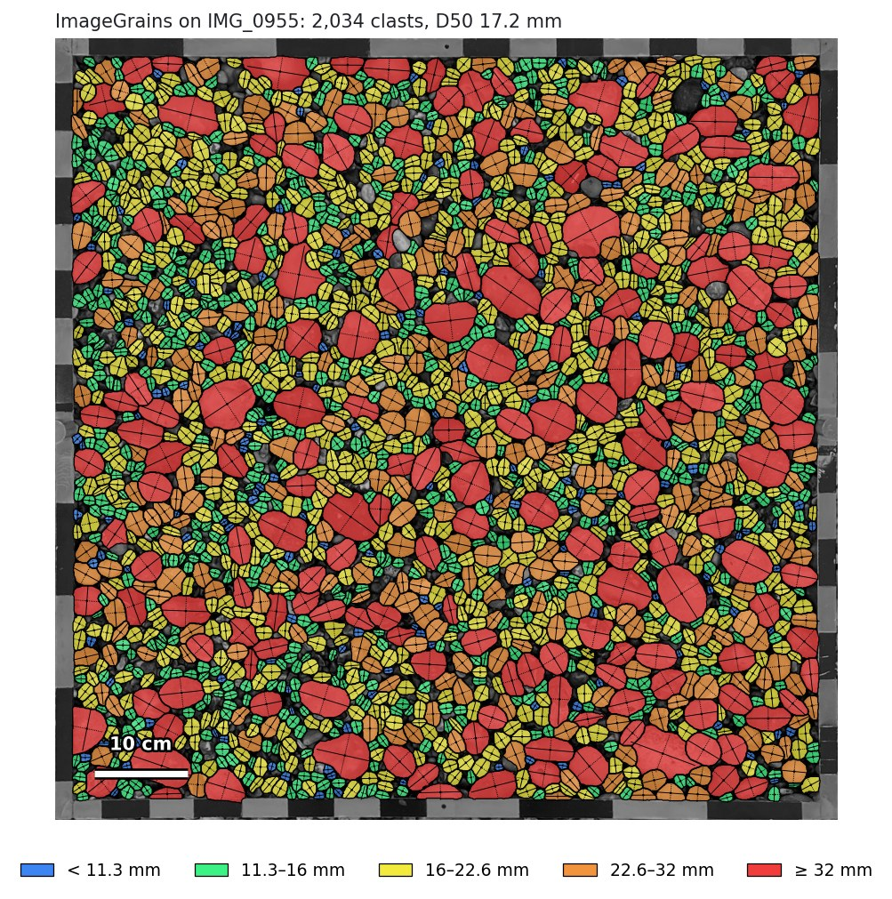
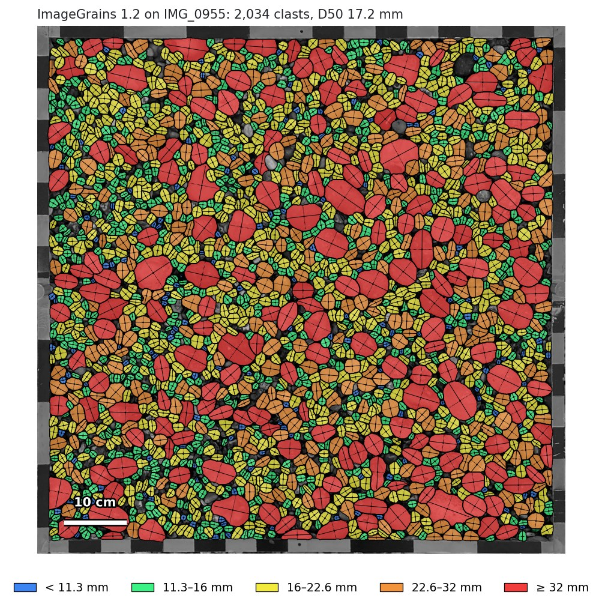
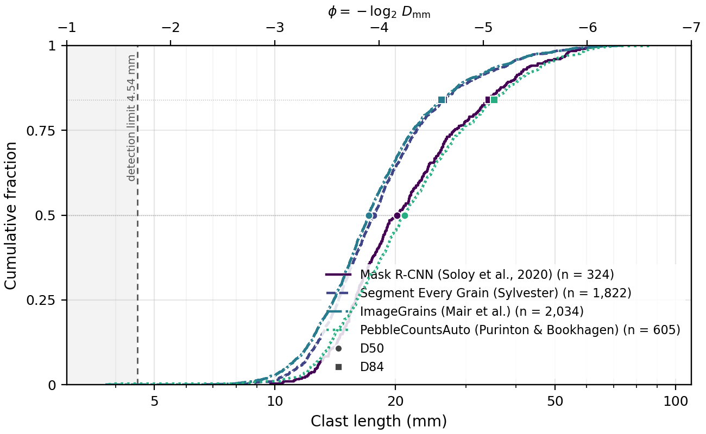

# ImageGrains as a PebbleMapper detection model

This plug-in lets [PebbleMapper](https://github.com/soloyant/pebblemapper) detect clasts
with [ImageGrains](https://github.com/dmair1989/imagegrains) (Mair et al.), Cellpose
models fine-tuned on images of sediment. It provides two detection models, one per
ImageGrains generation, which can be installed and used side by side. The adapter runs
each in its own conda environment, receives the grain outlines as a label image and hands
them to PebbleMapper, which measures every clast with its own measurement step. Sizes are
therefore defined exactly as for PebbleMapper's built-in Mask R-CNN model. Nothing in
PebbleMapper is modified.

The repository holds the adapter (built on PebbleMapper's `InstanceSubprocessBackend`),
the script that runs inside the ImageGrains environments and the environment files. The
models are not included; a script downloads them from the authors' Zenodo record.

## The two models

| | ImageGrains 2.0 | ImageGrains 1.2 |
|---|---|---|
| Name in PebbleMapper | **ImageGrains 2.0 (Mair et al., 2026)** | **ImageGrains 1.2 (Mair et al., 2023)** |
| Backend id (in result file names) | `imagegrains` | `imagegrains1` |
| Code | `imagegrains` 2.0.2, Cellpose 4 | `imagegrains` 1.2.1, Cellpose 2 |
| Network | Cellpose-SAM, a transformer | Cellpose 2, a CNN |
| Model | `IG2_full_set_cp_SAM` (1.2 GB) | `IG2_full_set.200525` (26 MB), trained on the same IG2 dataset |
| Hardware | an NVIDIA GPU with at least 3 GB | a CPU is enough |
| Environment | `environment-2.0.yml` (`pm-imagegrains`) | `environment.yml` (`pm-imagegrains1`) |

ImageGrains 2.0 is the version described in Mair et al. (2026). The two cannot share an
environment: Cellpose 2 and Cellpose 4 do not install together, and neither loads the
other's models. Install either or both.

## Requirements

- A working PebbleMapper installation.
- Conda (Miniconda or Anaconda).
- For ImageGrains 2.0, an NVIDIA GPU with at least 3 GB of memory. On a CPU it runs, but
  takes minutes per 256-pixel tile.
- About 6 GB of disk space for the 2.0 environment and 2 GB for the 1.2 one.

## Installation

1. Create the environment of the generation you want, or both, from this folder:

   ```bat
   conda env create -f environment-2.0.yml
   conda env create -f environment.yml
   ```

   The first creates `pm-imagegrains` (ImageGrains 2.0.2 with the CUDA 12.1 build of
   PyTorch); the second `pm-imagegrains1` (ImageGrains 1.2.1). On a machine without an
   NVIDIA GPU, remove the two index lines and the two torch lines from
   `environment-2.0.yml` first.

2. Download the models into `models/`:

   ```bat
   conda run -n pm-imagegrains python scripts/download_models.py
   ```

   The script runs ImageGrains' own downloader, which fetches every ImageGrains model from
   Zenodo into `~/imagegrains`, then copies the model files into `models/`. Set
   `PM_IG_WEIGHTS` to store them elsewhere.

3. Declare the models in PebbleMapper's `user_detectors.json`, one entry each. Copy
   `user_detectors.example.json` and set `path` to the folder of this repository; drop the
   entry of a generation you did not install:

   ```json
   [
    {"module": "pm_imagegrains_backend.backend", "factory": "make_backend",
     "path": "C:/path/to/pebblemapper-backend-imagegrains"},
    {"module": "pm_imagegrains_backend.backend", "factory": "make_backend_v1",
     "path": "C:/path/to/pebblemapper-backend-imagegrains"}
   ]
   ```

   `make_backend` is ImageGrains 2.0; `make_backend_v1` is ImageGrains 1.2.

4. Restart PebbleMapper.

## Usage in PebbleMapper

After the restart, **ImageGrains 2.0 (Mair et al., 2026)** and **ImageGrains 1.2 (Mair et
al., 2023)** appear in the **Detection model** selector in the left panel, next to Mask
R-CNN. Select one and run detection as usual. The result is the same per-clast table as
with Mask R-CNN; its file name carries `_model=imagegrains` or `_model=imagegrains1`, so
the two can be run on the same photographs and compared in the Validate tab.

Points to note:

- **Framed quadrat photographs.** ImageGrains segments every grain-like object, and the
  coloured bars of a quadrat frame count as such. A photograph rectified by
  PebbleMapper's Orthorectify carries the frame's thickness in its sidecar, and the frame
  band is left out automatically. For any other framed photograph, draw an *ROI per
  image* (Detect tab).
- **No confidence score.** Cellpose reports none, so every clast is scored 1.0.
  PebbleMapper's *Filter by confidence* is recorded in the run manifest but not applied.
- **Model options.** Options for `run.py` are passed through the `PM_IG_OPTIONS`
  environment variable as JSON: `model` (another model file from `models/` for the same
  generation), `diameter`, `min_size`, `rescale`, `channels` (1.2 only) and `max_side`
  (the long side the image is resampled to before segmentation, 2048 by default; labels
  come back at full size).
- **Environment names.** `PM_IG2_ENV` and `PM_IG1_ENV` override the environment names
  `pm-imagegrains` and `pm-imagegrains1`.

PebbleMapper writes the model's name, version and model file into every run's
`.manifest.json`.

## Licences

This repository contains only the adapter. The model code is installed by pip from its
published releases, and the models are downloaded by `scripts/download_models.py`.

| Component | Copyright | Licence |
|---|---|---|
| This adapter | © 2026 Antoine Soloy | MIT (`LICENSE`) |
| imagegrains 1.2.1 / 2.0.2 (code) | © 2023 David Mair | BSD-3-Clause |
| cellpose 2.3.2 / 4.2.1 (code) | © 2020 Howard Hughes Medical Institute | BSD-3-Clause |
| ImageGrains models (`IG1_old_set`, `IG2_*`, `IG2_full_set_cp_SAM`) | the ImageGrains authors | CC BY 4.0, Zenodo [10.5281/zenodo.15309323](https://doi.org/10.5281/zenodo.15309323) |

If you pass the models on, keep the attribution to their authors and the Zenodo link, as
CC BY 4.0 requires. The adapter is an independent project and is not affiliated with or
endorsed by the authors of ImageGrains or Cellpose.

## Citation

Cite the paper that matches the model you use.

**ImageGrains 2.0 (`IG2_full_set_cp_SAM`, Cellpose-SAM):**

- Mair, D., Witz, G., Do Prado, A., Garefalakis, P., Wild, A., Ville, F., Schuster, B.,
  Horn, M., Österle, J., Fabbri, S. C., Litty, C., Achleitner, S., Leistner, S., Hiller,
  C., & Schlunegger, F. (2026). ImageGrains 2.0: Improved precision and generalization
  for grain segmentation. *Earth Surface Dynamics*, 14, 527–551.
  https://doi.org/10.5194/esurf-14-527-2026
- Pachitariu, M., Rariden, M., & Stringer, C. (2025). Cellpose-SAM: superhuman
  generalization for cellular segmentation. *bioRxiv*.
  https://doi.org/10.1101/2025.04.28.651001

**ImageGrains 1.2 (Cellpose 2 models):**

- Mair, D., Witz, G., Do Prado, A. H., Garefalakis, P., & Schlunegger, F. (2023).
  Automated detecting, segmenting and measuring of grains in images of fluvial
  sediments: The potential for large and precise data from specialist deep learning
  models and transfer learning. *Earth Surface Processes and Landforms*.
  https://doi.org/10.1002/esp.5755
- Stringer, C. A., & Pachitariu, M. (2021). Cellpose: a generalist algorithm for cellular
  segmentation. *Nature Methods*, 18, 100–106. https://doi.org/10.1038/s41592-020-01018-x

## The same photograph through every model

The rectified quadrat photograph of PebbleMapper's `example_03_Etretat` (IMG_0955: 0.84 m
frame, 0.567 mm/px, a densely packed flint beach, 1,362 fully visible pebbles outlined by hand)
was run through every model PebbleMapper can use, with the frame band left out and each
clast measured by PebbleMapper's own step. The ImageGrains plug-in provides two models,
ImageGrains 2.0 and 1.2.

| Model | Detections | True positives | Recall | Precision | F1 | Length RMSE | D50 | D84 | Time per photograph |
|---|---|---|---|---|---|---|---|---|---|
| Hand outlines (reference) | 1,362 | | | | | | 17.7 mm | 26.5 mm | |
| Mask R-CNN (PebbleMapper, built in) | 324 | 320 | 0.23 | 0.99 | 0.38 | 1.6 mm | 20.2 mm | 34.2 mm | 41 s (GPU) |
| Segmenteverygrain | 1,822 | 1,350 | 0.99 | 0.74 | 0.85 | 1.0 mm | 17.7 mm | 26.3 mm | 259 s (GPU) |
| ImageGrains 2.0 | 2,928 | 1,346 | 0.99 | 0.46 | 0.63 | 1.4 mm | 14.5 mm | 22.1 mm | 154 s (GPU) |
| ImageGrains 1.2 | 2,034 | 1,316 | 0.97 | 0.65 | 0.78 | 1.7 mm | 17.2 mm | 26.0 mm | 51 s (CPU) |
| PebbleCountsAuto | 605 | 491 | 0.36 | 0.81 | 0.50 | 4.1 mm | 21.0 mm | 35.3 mm | 17 s (CPU) |
| OrthoSAM | 1,659 | 1,079 | 0.79 | 0.65 | 0.71 | 1.4 mm | 17.6 mm | 26.8 mm | 430 s (GPU) |

Detections are paired with the 1,362 hand-outlined clasts by position and size, as
PebbleMapper's Validate tab does. A true positive is a detection paired with a
hand-outlined clast; recall is true positives over the 1,362 hand-outlined clasts,
precision is true positives over the detections, and F1 is their harmonic mean. False
negatives (1,362 minus true positives) and false positives (detections minus true
positives) follow from the table. Length RMSE is computed on the true positives.

The hand outlines keep only the pebbles lying fully visible on top of the sediment;
partly buried and overlapping pebbles were removed by hand. This is the rule Mask R-CNN's
training labels follow. The hand outlines were started from Segmenteverygrain's
detections. Times are for one photograph once the model is loaded (loading adds 7 to
70 s once per run), on a 2018 laptop (Intel Core i7-8850H, NVIDIA Quadro P600 with 4 GB).
ImageGrains 1.2 and PebbleCountsAuto run on the CPU.

Settings used for every run in the table:

| Model | Code and model file | Settings |
|---|---|---|
| Mask R-CNN | PebbleMapper 1.0.0, `mask_rcnn_clasts.h5` | minimum confidence 0.7; the whole photograph is resized to 1,024 × 1,024 px inside the network |
| Segmenteverygrain | segmenteverygrain 0.5.0; U-Net `seg_model_smooth_labels.keras`; SAM 2.1 `sam2.1_hiera_large.pt` | patch 2,000 px, overlap 600 px; `min_area` 100 px, `min_grain_area` 50 px, `dbs_max_dist` 20, `dilation` 3; edge grains kept |
| ImageGrains 2.0 | imagegrains 2.0.2, Cellpose 4.2.1; `IG2_full_set_cp_SAM` | Cellpose `min_size` 15 px, diameter estimated by Cellpose; long side capped at 2,048 px; none of ImageGrains' own filters (`min_diameter`, `pix_cutoff`, `edge_filter`) |
| ImageGrains 1.2 | imagegrains 1.2.1, Cellpose 2.3.2; `IG2_full_set.200525`, a Cellpose 2 model trained on the IG2 dataset (not an IG1 model) | as for 2.0, with `channels` [0, 0] |
| PebbleCountsAuto | PebbleCounts 4c80b2f (2023), `PebbleCountsAuto.py` | `otsu_threshold` 50, `cutoff` 20, `percent_overlap` 15, `misfit_threshold` 30, `min_size_threshold` 10, `first_nl_denoise` 5, `tophat_th` 90, `sobel_th` 90, `canny_sig` 2 |
| OrthoSAM | OrthoSAM 18da0e5; SAM v1 `sam_vit_b_01ec64.pth` | tile 1,024 px, overlap 200 px, 30 × 30 prompts per tile, stability 0.85, dilation 5, smallest grain 30 px; a second pass at half resolution |

For every model, the frame band is left out and every returned outline is measured by
PebbleMapper's own step, so the sizes in the table are areal (by number of clasts), not grid
samples.

<p align="center">
  
</p>
<p align="center"><em>ImageGrains 2.0's detections on the whole photograph, each clast filled by size class and outlined, its long and short axes drawn.</em></p>

<p align="center">
  
</p>
<p align="center"><em>ImageGrains 1.2's detections on the same photograph, drawn the same way.</em></p>

<p align="center">
  
</p>
<p align="center"><em>A 40 cm crop of the same photograph: the hand outlines and each model's detections, both ImageGrains versions included, on the same size classes in every panel.</em></p>

<p align="center">
  
</p>
<p align="center"><em>Cumulative distributions of clast length, D50 (circle) and D84 (square) marked; the grey band is below 8 pixels, the detection limit of this photograph.</em></p>
